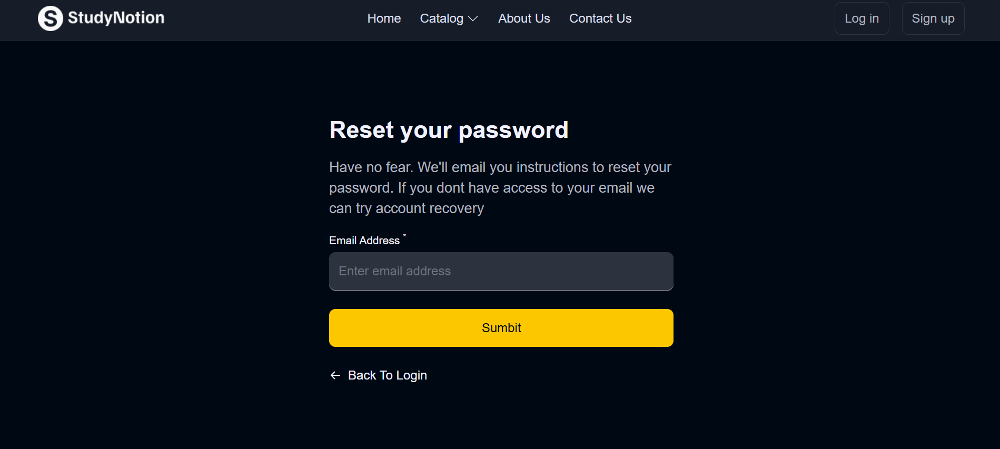
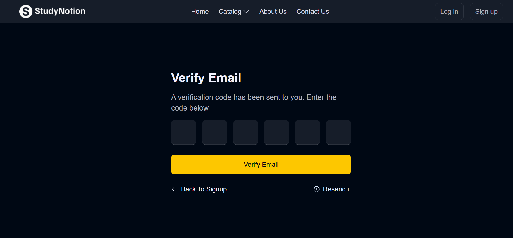
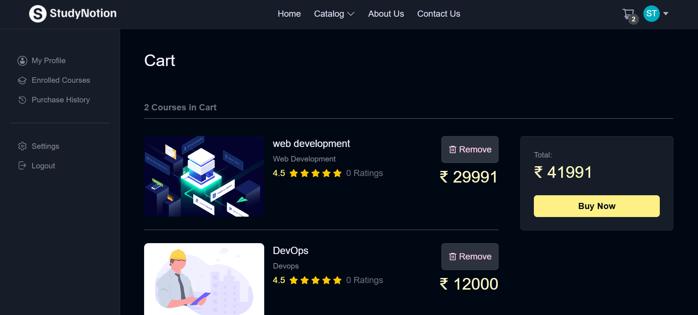
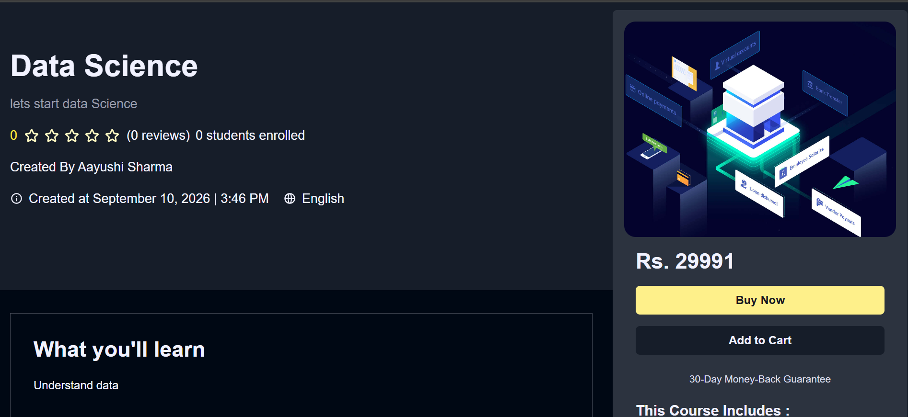
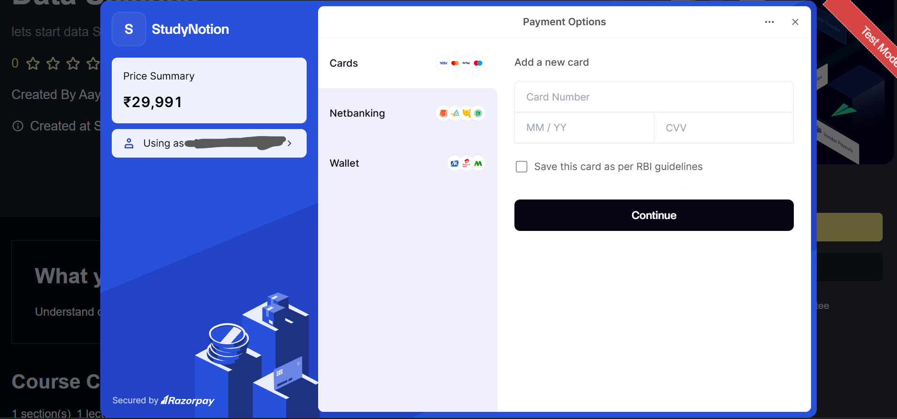
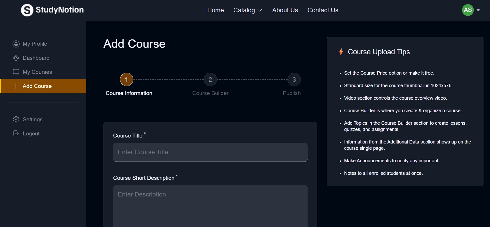
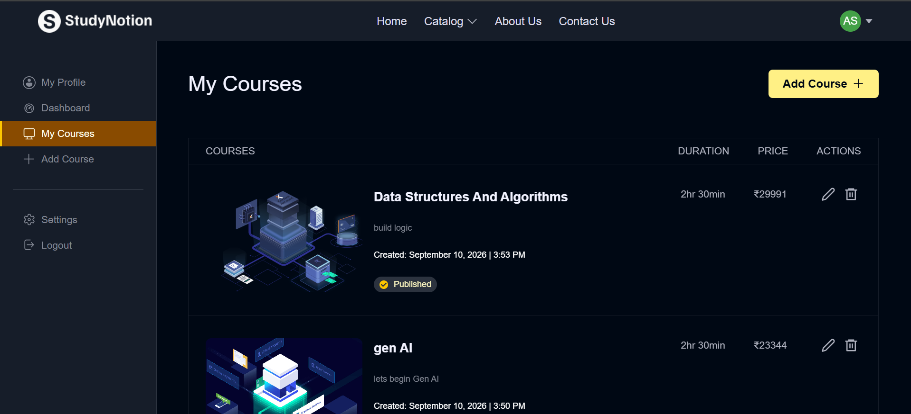

# StudyNotion 🎓

StudyNotion is a full-stack EdTech platform where students can explore courses, create an account, add courses to their cart, make payments, and track their learning progress. Instructors can create and manage their courses through the platform.

## 🚀 Live Demo

**[StudyNotion Live Demo](https://study-notion-one-bice.vercel.app/)**

## 🚀 Features

### 👨‍🎓 Student Features

* User Signup & Login
* OTP-based account verification
* Forgot Password / Reset Password
* Browse and explore courses
* Course details page
* Add courses to cart
* Course enrollment
* Payment integration with Razorpay
* Course progress tracking
* Course ratings and reviews
* User profile management

### 👨‍🏫 Instructor Features

* Instructor account
* Create courses
* Edit and manage courses
* Upload course thumbnails and content
* Publish courses
* Manage instructor courses

### ⚙️ Other Features

* JWT-based authentication
* MongoDB database
* Cloudinary integration for media
* Resend integration for emails and OTP
* Responsive user interface
* REST API-based backend

## 🛠️ Tech Stack

### Frontend

* React.js
* JavaScript
* React Router
* Redux Toolkit
* Tailwind CSS
* Axios
* React Hook Form

### Backend

* Node.js
* Express.js
* MongoDB
* Mongoose
* JWT

### Third-Party Services

* Cloudinary
* Razorpay
* Resend

## 📸 Screenshots

### 🏠 Home Page


### 🏠 Home Page — Section 2


### 🔐 Login


### 📩 Forgot Password



### 🔢 OTP Verification



### 🛒 Cart



### 📚 Course Page



### 💳 Payment Gateway



### ℹ️ About Page


### ➕ Create Course



### 👨‍🏫 Instructor Courses



## 📁 Project Structure

```text
StudyNotion/
│
├── backend_studynotion/
│
├── src/
│   ├── components/
│   ├── pages/
│   ├── services/
│   ├── slices/
│   ├── assets/
│   └── App.jsx
│
├── screenshots/
│   ├── home.png
│   ├── home2.png
│   ├── login.png
│   ├── forgot-password.png
│   ├── otp.png
│   ├── cart.png
│   ├── course-page.png
│   ├── payment.png
│   ├── about.png
│   ├── create-course.png
│   └── instructor-courses.png
│
├── package.json
└── README.md
```

## ⚙️ Installation & Setup

### 1. Clone the repository

```bash
git clone https://github.com/Aayushi-800/StudyNotion.git
cd StudyNotion
```

### 2. Install frontend dependencies

```bash
npm install
```

### 3. Install backend dependencies

```bash
cd backend_studynotion
npm install
```

### 4. Environment Variables

Create the required `.env` files for the frontend and backend and add your own credentials for:

* MongoDB
* JWT
* Cloudinary
* Resend
* Razorpay

> Never commit `.env` files or secret keys to GitHub.

### 5. Run the project

Start the backend and frontend according to the scripts configured in the project.

The application will then be available locally in your browser.

## 📚 What I Learned

While building StudyNotion, I worked with:

* Full-stack MERN application architecture
* REST API development
* Authentication and authorization
* JWT-based protected routes
* MongoDB and Mongoose
* Redux Toolkit for state management
* React Router
* Form handling and validation
* File and image uploads
* Email and OTP verification
* Payment gateway integration
* Course and user management
* Frontend-backend API integration
* Debugging and troubleshooting
* Deployment using Vercel and Render

## 🔮 Future Improvements

* Improve instructor analytics dashboard
* Add more comprehensive student learning analytics
* Improve course search and filtering
* Add additional payment and notification options
* Further improve UI/UX

## 👩‍💻 Author

**Aayushi**

GitHub: [Aayushi-800](https://github.com/Aayushi-800)
